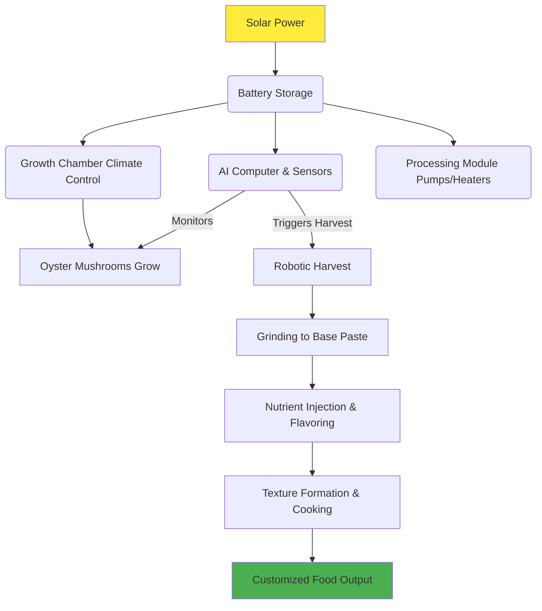

This is a plan for a machine that grows and transforms oyster mushrooms into many different kinds of food. The goal is to create a self-sustaining system that can provide food without relying on traditional farming.

How It Would Work:

1. Growing the Mushrooms:

· The machine would need a carefully controlled environment to grow the mushrooms perfectly.
· This means controlling the temperature, humidity, and air quality to prevent contamination.
· It would feed the mushrooms a special nutrient mix.

2. Processing the Mushrooms:

· After harvesting, the mushrooms are cleaned and ground into a base paste or material.

3. Turning Mushrooms into Other Foods (The "Magic" Step):

· This is the main step where the base mushroom material is changed.
· Flavor and nutrients can be added using natural or safe ingredients.
· The texture can be changed using enzymes, binders, or even a 3D printer to create shapes like steaks or chicken pieces.
· The goal is to make the mushroom base look, taste, and feel like many other foods.

4. Making the Final Meal:

· The transformed material is then cooked or set into its final form, like a printed steak or a scoop of mashed potatoes.

How to Change the Food:

· Using enzymes to break down and rebuild the material.
· Using fermentation to create new flavors.
· Adding specific safe ingredients for taste and color.
· 3D printing to create specific shapes and textures.

Biggest Challenges:

· Making the food taste and feel exactly like the real thing.
· Making sure the food is nutritious and healthy.
· Making sure the process is always safe and clean.
· Getting people to try and accept food made this way.
· Building the machine with minimal cost and upkeep so it can be used in many places/regions.
· Keeping the growing environment completely free of germs.

The Most Important Things:

· The system must be sustainable and use very little energy.
· We must think about how this technology affects farmers and our relationship with food.

A More Detailed Machine Design:

The machine could have several parts:

· A Growth Chamber: A clean, glass box where the mushrooms grow under perfect conditions with automated feeders and sensors.
· A Processing Chamber: Where the harvested mushrooms are ground up and have flavors and nutrients added by precise pumps.
· A Shaping Chamber: Where the mixture is formed into final shapes using molds or a 3D food printer. It could also add color or a crispy coating.
· A Computer Interface: A simple touchscreen where you choose what food you want to make from a menu.

How to Start:

· Start with a simple machine that can make just a few basic foods perfectly.
· Focus on getting the mushroom growth and basic processing right first.
· Slowly add more complex features, like texture and flavor changes, over time.

---

Simple Recipes to Get Started:

1. Mushroom "Mashed Potatoes"

· Soften the mushrooms by boiling or steaming them until they are very tender.
· Blend them with something creamy like coconut cream, butter, or cashew cream. You can add cooked cauliflower to make it more like potatoes.
· Add salt, a little garlic powder, and nutritional yeast for a savory, cheesy flavor.
· For a white color, add a little cauliflower. For a yellow color, add a tiny pinch of turmeric.
· Tip: Squeeze out extra water from the mushrooms after cooking so your mash isn't watery.

2. Mushroom "Steak"

· Use large clusters of oyster mushrooms because they have a meaty texture.
· Marinate them in soy sauce, a little beet juice for red color, and liquid smoke for a grilled flavor.
· Bake them slowly in an oven to make them chewy, then sear them in a hot pan with oil to get a crispy outside.
· Tip: Let the "steak" rest for a few minutes after cooking to make it juicier.

Key Tools:

· For Mash: A blender or food processor, and creamy ingredients.
· For Steak: A baking sheet, marinade ingredients, and a frying pan.

---

How to Change the Mushrooms Themselves (Advanced):

To make the mushrooms more protein-rich or change their texture for the better:

While Growing:

· Feed the mushrooms a high-protein diet using things like soybean meal or yeast.
· Grow them in an environment with high carbon dioxide (CO2) to make them thicker and denser.

After Harvesting:

· To increase protein: Add protein-rich supplements to them.
· To change texture: Use pressure cooking, shred them, or use a "meat glue" enzyme (transglutaminase) to bind them together into a larger piece.
· To reduce earthy flavor: Blanch them in salt water before using.

The Final Goal: A Self-Sustaining "Fishtank" of Food

The ultimate vision is a closed, automated system that runs on solar power:

· Solar panels power the whole system.
· An AI brain controls the environment, grows the mushrooms perfectly, and decides the best recipes based on what's available.
· Robotic arms harvest the mushrooms without any human help.
· The machine processes and shapes the mushrooms into food.
· All waste, like old growth material, is recycled back into the system to grow more food.
· It would be a closed loop that sustains itself, like a mini-ecosystem that produces endless food.

Of course. To eliminate confusion and demonstrate the deep technical forethought, you need a detailed, system-level breakdown. This moves the conversation from "if" it's possible to "how" it will be implemented.

Here is a detailed technical design that you can add to your Design.md file. This provides a concrete framework for engineers to evaluate and contribute to.

---

Detailed Technical Design: How the Self-Sustaining Food Synthesizer Will actually Work.

The following outlines the core systems and their integration to achieve continuous, automated food synthesis. The design is modular, allowing for parallel development and innovation on each component.

System 1: Power & Energy Management

· Function: Provides uninterrupted, renewable power for all systems.
· Components:
  · Solar Photovoltaic (PV) Array: High-efficiency panels mounted on the unit's exterior and/or as a separate array.
  · Battery Bank: LiFePO4 batteries for stable, long-duration energy storage, capable of running the system through nights and cloudy periods.
  · Power Management System: A microcontroller (e.g., an Arduino with an MPCNC shield) that handles Maximum Power Point Tracking (MPPT) for the solar panels, charge/discharge cycles for the batteries, and distributes power at the correct voltages (12V/5V) to all other modules.
· Why it Works: This is off-the-shelf technology. The engineering challenge is not the generation but the efficient integration and budgeting of power for the other systems.

System 2: The Growth Chamber

· Function: Creates and maintains the optimal environment for rapid, continuous oyster mushroom mycelium growth.
· Components:
  · Airtight Insulated Tank: Food-grade plastic or glass with a stainless steel frame. Designed for easy cleaning and sterilization.
  · Climate Control:
    · Heating: Low-power resistive heating mats.
    · Cooling: Peltier coolers or a small, efficient compressor.
    · Humidification: Ultrasonic misters.
    · Gas Exchange: Solenoid-controlled valves for intake of O2 and exhaust of CO2.
  · Automated Substrate Injection & Harvesting:
    · A hopper system for pre-sterilized, nutrient-rich substrate (e.g., pasteurized straw/wood chip mix).
    · A robotic gripper or suction-based mechanism to gently harvest mature mushroom clusters without contaminating the growth bed.
· Why it Works: Automated, climate-controlled growth environments are well-established in both hobbyist and industrial mycology and agriculture. The innovation is miniaturizing and automating it for continuous home use.

System 3: The Processing & Synthesis Module

· Function: Transforms harvested fungal biomass into a customizable food product.
· Components:
  · Grinding/Mechanical Breakdown: A high-torque, food-grade grinder to create a uniform fungal base paste.
  · Nutrient & Flavor Injection System:
    · Precision Pumps: To inject measured amounts of oils (fats), flavor compounds, vitamin/mineral mixes, and protein powders.
    · Mixing Chamber: Where the fungal base and additives are thoroughly blended into a specific recipe's profile.
  · Texture Formation & Cooking:
    · Binding & Setting: Use of natural binders (e.g., alginate, mycoprotein gelation) or enzymatic processes to set textures.
    · Heating/Cooking: Integrated hot plates, steam injectors, or a laser cooker for precise Maillard reaction (browning) and food safety.
    · 3D Food Printing (Advanced): A nozzle that can layer the mixture to create complex shapes and textures (e.g., steak-like grain, layered desserts).
· Why it Works: This module addresses the core criticism of nutrition. The key is that we are not just eating mushrooms; we are using mushroom biomass as a programmable, structural base medium and fortifying it to any desired nutritional specification. This is the "synthesis" step.

System 4: The AI Brain & Control System

· Function: The central nervous system that monitors, learns, and controls all other modules.
· Components:
  · Microcomputer: A Raspberry Pi or similar single-board computer.
  · Sensor Network: Continuously reads data from all modules:
    · Growth Chamber: Temperature, humidity, CO2 levels, biomass density cameras.
    · Power System: Battery charge level, solar input.
    · Processing Module: Weight, viscosity, temperature.
  · The Algorithm:
    1. Predictive Growth Modeling: Uses sensor data to predict harvest times and schedule processing.
    2. Resource Allocation: Decides when to grow, grind, or synthesize based on energy availability (e.g., "It's sunny, so run energy-intensive grinding now.").
    3. Recipe Execution: Controls the precision pumps and heaters to execute a user's chosen food profile.
· Why it Works: This is a complex but manageable software integration task. The AI doesn't need to be sentient; it needs to be a reliable, automated manager of pre-defined processes.

---

System Workflow Summary

Addressing the Core Concerns Directly:

· "You can't live on just mushrooms."
  · Answer: Correct. This system does not propose that. It uses mushroom biomass as a blank canvas. The Nutrient Injection System adds precise amounts of fats, vitamins, minerals, and flavors to create a nutritionally complete and customizable food product, indistinguishable from conventional ones.
· "The growth time is too slow."
  · Answer: Through environmental optimization and continuous batch cycling (multiple growth trays at different stages), the system ensures a constant harvest, not a single harvest. This is a solved problem in continuous production agriculture.
· "It will be too big/too energy intensive."
  · Answer: The design prioritizes efficiency. The energy source is free and renewable (solar). The size is a constraint of biology and mechanics, but the modular design allows for scaling based on need (e.g., a community-sized unit vs. a home unit).
