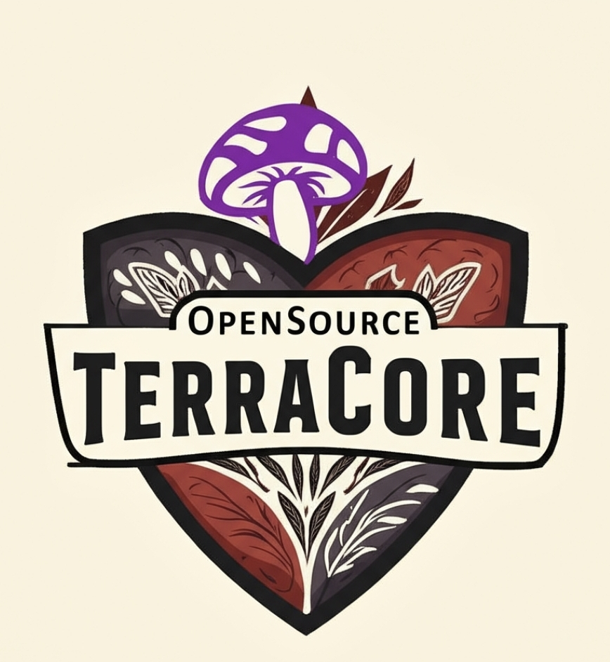
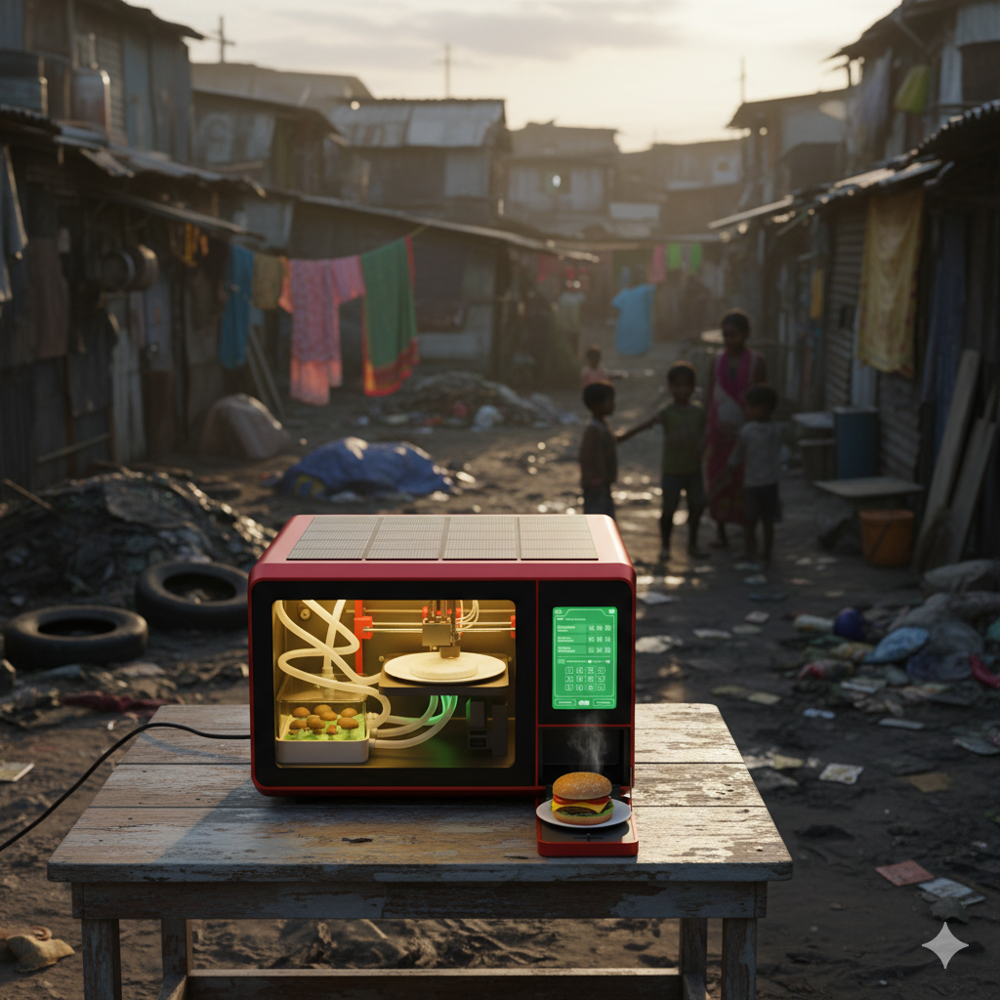
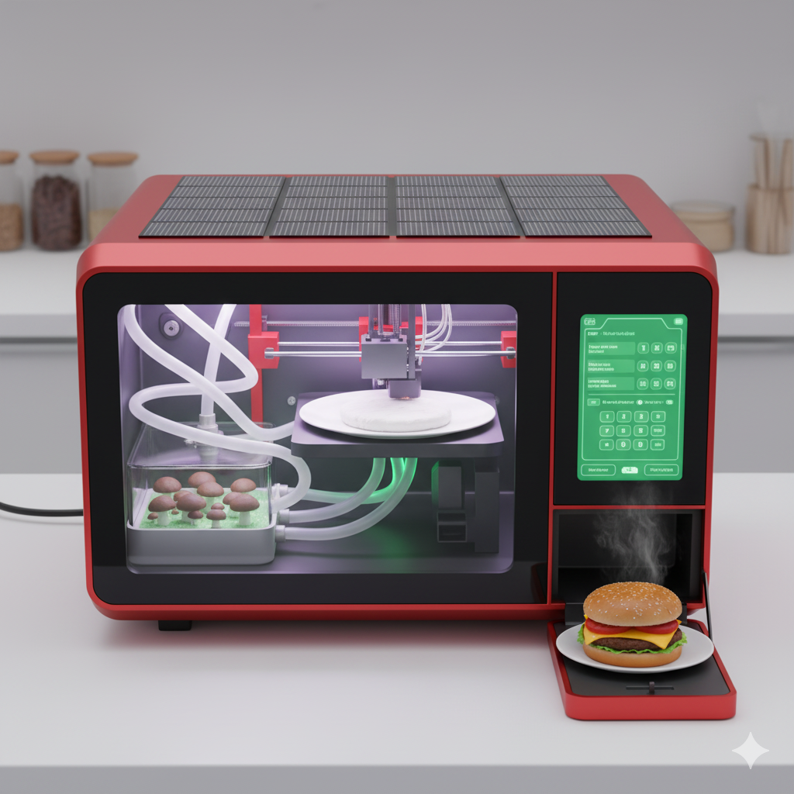

# Technical Design: TerraCore™ Genesis Unit (Mk1)

## 🎯 1.0 Abstract & Vision
**TerraCore™** is an open-source, solar-powered hardware system that automates decentralized food production. The Genesis Unit (Mk1) grows oyster mushroom biomass and transforms it into diverse, nutritious foods through mechanical texturization and precision fortification.

## 🏗️ 2.0 System Architecture
The TerraCore™ system follows a linear production pipeline where solar energy powers everything. Mushrooms grow in climate-controlled chambers, get harvested, then move to synthesis modules that transform the biomass into finished food. All controlled by an automated control system.

**TerraCore™ Production Flow:** Sun → Solar → Batteries → Growth → Harvest → Synthesis → Food

## ⚙️ 3.0 Core Modules

### 🔋 3.1 Power & Energy Management
- **Solar Array**: 400W scalable panels with smart charging
- **Battery Bank**: LiFePO4 batteries for all-day operation  
- **Power Management**: Optimizes energy use for continuous operation

### 🌱 3.2 Growth Chamber
- **Climate Control**: Automated temperature, humidity, air quality
- **Sterile Environment**: HEPA filters, UV sterilization
- **Automation**: Efficient harvesting and maintenance
- **Continuous Cycle**: Always growing, always harvesting

### 🍽️ 3.3 Synthesis Module
- **Grinding**: Turns mushrooms into uniform paste
- **Injection**: Adds precise nutrients, flavors, textures
- **Forming**: Creates final food shapes and textures
- **Cooking**: Finishes with searing, steaming, baking

### 🧠 3.4 Control System
- **Central Computer**: Coordinates all operations
- **User Interface**: Simple controls and monitoring
- **System Optimization**: Maintains optimal growing conditions

## 🔄 4.0 From Biomass to Food
1. Harvest mushrooms → 2. Grind to paste → 3. Add nutrients → 4. Set texture → 5. Cook and serve

## 🚀 5.0 Development Roadmap
**Now**: Building TerraCore™ Genesis Unit growth chamber prototype  
**Next**: Developing synthesis system for the Genesis Unit  
**Future**: Full integration and testing of complete TerraCore™ system

## 👥 6.0 Call for Collaboration
The TerraCore™ project needs: Mycologists, Engineers, Food Scientists, Developers  
**Get Started**: Fork this repo, join discussions, help build the future of food

## ❓ 7.0 FAQ
**Q**: Is TerraCore™ just a mushroom grower?
**A**: No - it transforms biomass into different foods through synthesis

**Q**: Can it provide complete nutrition?
**A**: Yes - the system fortifies with precise nutrients for balanced meals

**Q**: What makes TerraCore™ different?
**A**: Complete solar-powered automation from growth to final food product

---

*Part of the TerraCore™ Project - Growing a resilient future, one unit at a time.*  
*Last updated 23-SEP-2025*
