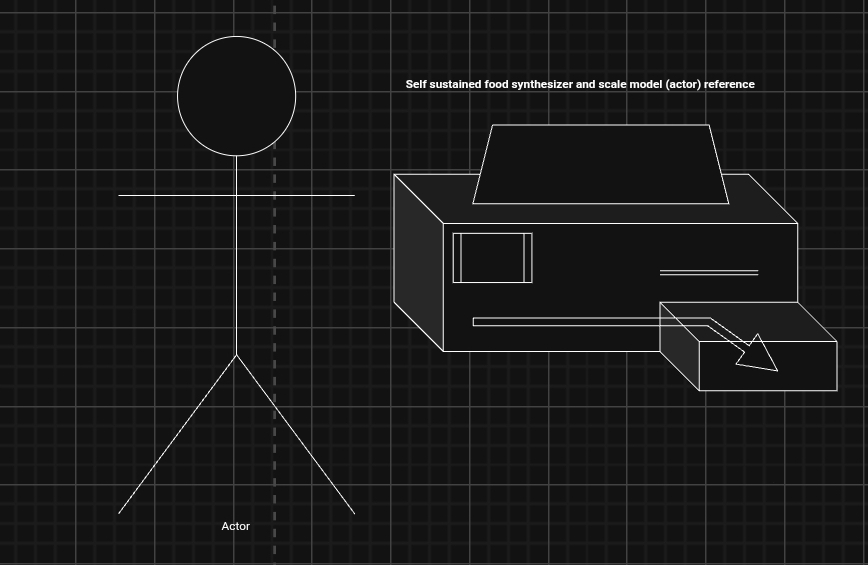

---

The Self-Sustaining Food Synthesizer

An Open-Source Project to Decentralize Food Production and End Dependency on Industrial Agriculture.

The Vision

A self-sustaining, solar-powered system that uses AI to transform oyster mushrooms into nutritious, diverse foods. This is a blueprint for a future where everyone can produce their own food, free from centralized supply chains.

The Story

I designed this system while experiencing chronic homelessness in Australia, fighting every day for stability for myself and my animals.

This project is not for sale. It is my attempt to contribute something meaningful to a world that often feels like it has left people behind. I am open-sourcing it because I believe everyone deserves food security.

My goal is to minimize the needless slaughter of animals, reduce environmental destruction from industrial farming, and help guide humanity toward a more compassionate and sustainable age. This work is driven by a profound belief that we can do better.

The Ask: Seeking a Patron

My immediate goal is to find a financial backer or patron. With basic stability—a safe place to live and work—I can dedicate myself fully to developing this prototype and focusing on other ideas for a more sustainable and equitable world.

I am not asking for an investment in a company. I am seeking a patron who believes in supporting individuals with ideas that can genuinely change the world.

If you are interested in providing this support, please contact me at: Joshfonzydaki@hotmail.com

google-site-verification: googlee3af5f3cc22a3072.html
