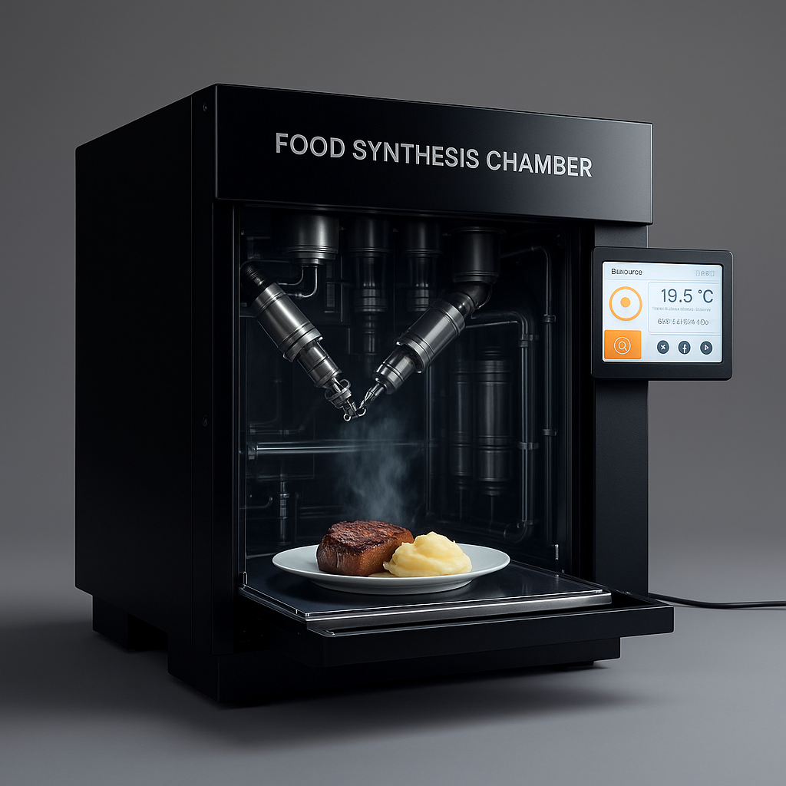

# TerraCore™: The Open-Source Solar Food Synthesizer

> **Grow Your Own World**

**TerraCore™** is an open-source, solar-powered system that grows and synthesizes food from mushroom biomass. This project aims to decentralize food production and end dependency on industrial agriculture.

**TerraCore™ is a trademark representing this specific open-source project. See our [Trademark Policy](TRADEMARK.md) for usage guidelines.**

---

## 🌱 The Vision: A Food-Secure Future

Imagine a future where every home, community, and village can produce its own nutritious, diverse food. Not through traditional farming, but with a quiet, solar-powered appliance that requires no land, minimal water, and creates zero waste.

The **TerraCore™** system automates the cultivation of oyster mushrooms and transforms this fast-growing biomass into a wide range of familiar foods through a process of mechanical texturization and precise nutrient fortification. This is not just a new gadget; it's a pathway to resilience, sustainability, and freedom from centralized supply chains.

## 🚀 The TerraCore™ Project Line

- **TerraCore Genesis Unit (Mk1)** - The current prototype: A proof-of-concept buildable with basic tools
- **Future Versions** - More advanced, automated systems built upon the Genesis Unit's success

## 📄 License

This project's technical content is licensed under **Creative Commons Attribution-NonCommercial-ShareAlike 4.0 International**.

**You are free to:**
- **Share** — copy and redistribute the material in any medium or format
- **Adapt** — remix, transform, and build upon the material

**Under the following terms:**
- **Attribution** — You must give appropriate credit, provide a link to the license, and indicate if changes were made
- **NonCommercial** — You may not use the material for commercial purposes
- **ShareAlike** — If you remix, transform, or build upon the material, you must distribute your contributions under the same license

*View the full license: [CC BY-NC-SA 4.0](https://creativecommons.org/licenses/by-nc-sa/4.0/)*

## 🔗 Project Resources

- **[TerraCore Genesis Unit (Mk1) Specifications](Design.md)** - Technical details of the first prototype
- **[Project Wiki](https://github.com/JDM95aus/OpenSource-TerraCore/wiki)** - Ongoing documentation and collaboration
- **[GitHub Discussions](https://github.com/JDM95aus/OpenSource-TerraCore/discussions)** - Join the community conversation
- **[Trademark Policy](TRADEMARK.md)** - Guidelines for using the TerraCore™ name

---

*This is a living project. Last updated on 22-SEP-2025.*
